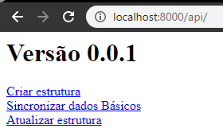

# backend
Backend da aplicação.

### 1. Adicione a pasta API no servidor PHP

### 2. Acesse a API pelo navegador

```
Exemplo: http://localhost/api
```

### 3. Clique em "Criar estrutura"

```
Vai criar toda a base de dados da aplicação, criando o usuário "ti@judbrass.com.br", com a senha "adm.judbrass"
```



## Arquivo de importação para o INSOMNIA

```
* Login - "Insomnia_mega_hack.json"
```